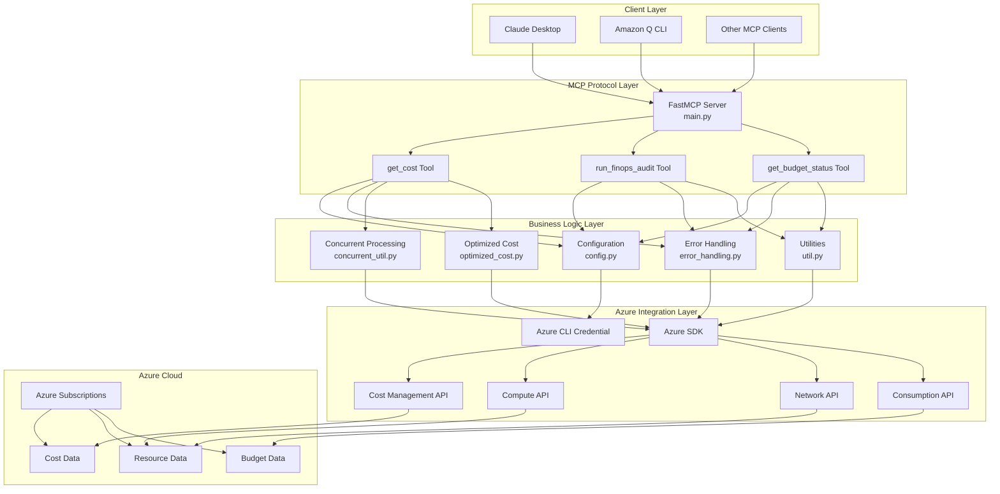
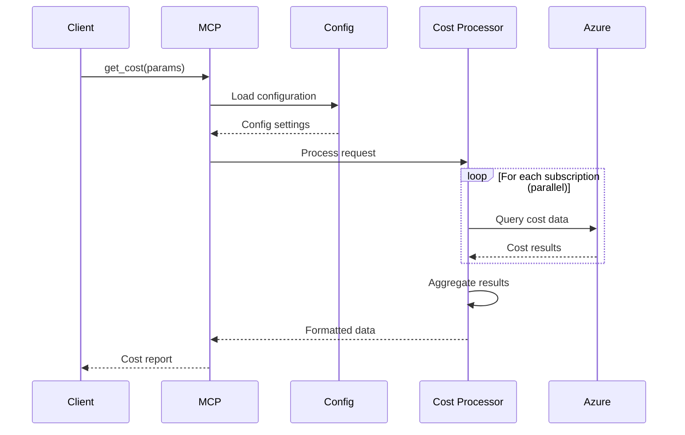
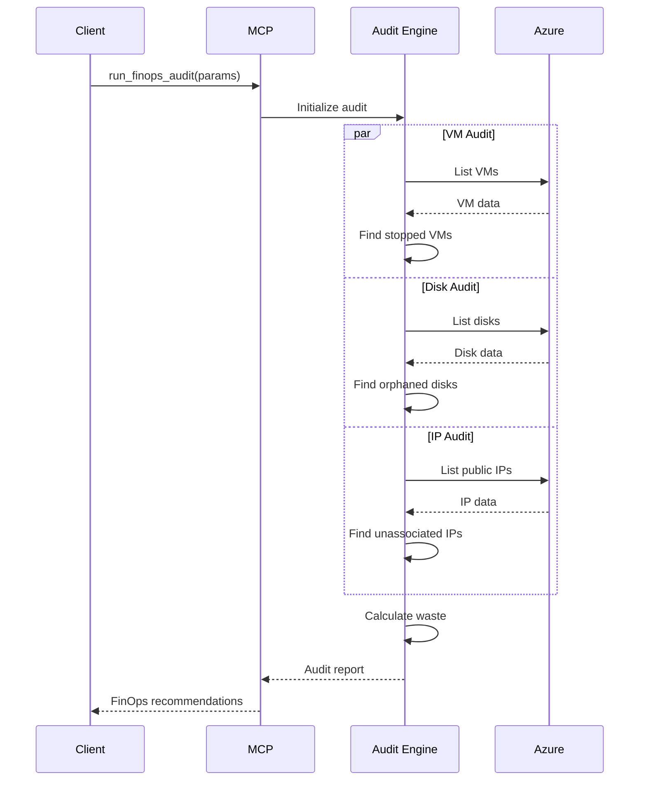
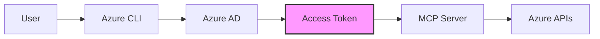

# Azure FinOps MCP Server Architecture

## Overview

The Azure FinOps MCP Server is a Model Context Protocol (MCP) server that provides Azure cost management and optimization capabilities to AI assistants. It follows a modular, layered architecture designed for security, performance, and maintainability.

## Architecture Diagram



## Component Architecture

```
azure-finops-mcp-server/
├── azure_finops_mcp_server/
│   ├── main.py                    # MCP server entry point and tool definitions
│   ├── config.py                  # Configuration management
│   └── helpers/
│       ├── concurrent_util.py     # Parallel processing utilities
│       ├── error_handling.py      # Error handling framework
│       ├── optimized_cost.py      # Optimized cost processing
│       └── util.py                 # Azure operations utilities
├── docs/                           # Documentation
├── tests/                          # Test suite
└── .env.example                    # Configuration template
```

## Layer Descriptions

### 1. Client Layer
- **Purpose**: AI assistants and MCP-compatible clients
- **Components**: Claude Desktop, Amazon Q CLI, custom clients
- **Protocol**: MCP over stdio/HTTP

### 2. MCP Protocol Layer
- **Purpose**: Expose Azure FinOps capabilities as MCP tools
- **Components**:
  - FastMCP server framework
  - Tool definitions (get_cost, run_finops_audit, get_budget_status)
- **Responsibilities**:
  - Protocol handling
  - Request/response formatting
  - Tool registration

### 3. Business Logic Layer
- **Purpose**: Core application logic and processing
- **Components**:
  - **Configuration** (`config.py`): Environment-based settings
  - **Error Handling** (`error_handling.py`): Consistent error management
  - **Concurrent Processing** (`concurrent_util.py`): Parallel operations
  - **Optimized Cost** (`optimized_cost.py`): Performance-optimized cost queries
  - **Utilities** (`util.py`): Azure resource operations
- **Responsibilities**:
  - Business rules implementation
  - Data processing and aggregation
  - Performance optimization
  - Error recovery

### 4. Azure Integration Layer
- **Purpose**: Interface with Azure services
- **Components**:
  - Azure CLI Credential for authentication
  - Azure SDK clients
  - Service-specific APIs
- **Responsibilities**:
  - Authentication management
  - API call abstraction
  - Response parsing

### 5. Azure Cloud Layer
- **Purpose**: Azure cloud resources and data
- **Components**:
  - Multiple Azure subscriptions
  - Cost and usage data
  - Resource metadata
  - Budget configurations

## Data Flow

### Cost Analysis Flow


### FinOps Audit Flow


## Key Design Decisions

### 1. Security First
- **Local Execution**: Server runs on user's machine
- **Credential Management**: Uses Azure CLI credentials, never stores secrets
- **Read-Only Operations**: Only performs read operations on Azure resources

### 2. Performance Optimization
- **Parallel Processing**: Concurrent subscription processing (5 workers default)
- **Caching**: In-memory cache with configurable TTL
- **Batch Operations**: Minimize API calls through batching

### 3. Error Resilience
- **Comprehensive Error Handling**: Typed exceptions for different failure modes
- **Retry Logic**: Automatic retry with exponential backoff
- **Graceful Degradation**: Partial results on partial failures

### 4. Configuration Management
- **Environment Variables**: All settings externalized
- **Validation**: Configuration validated on load
- **Multi-Environment**: Support for different Azure clouds

### 5. Extensibility
- **Modular Design**: Easy to add new tools and operations
- **Plugin Architecture**: New audit checks can be added independently
- **Standard Interfaces**: Consistent patterns for new components

## Scalability Considerations

### Current Capabilities
- Handles 10+ subscriptions concurrently
- Processes 1000s of resources per audit
- Sub-second response for cached data

### Scaling Strategies
1. **Horizontal**: Increase worker count for more parallelism
2. **Caching**: Redis/external cache for multi-instance deployment
3. **Async Operations**: Full async/await for better concurrency
4. **Resource Pooling**: Connection pool for Azure clients

## Security Architecture

### Authentication Flow


### Security Layers
1. **Authentication**: Azure CLI/DefaultAzureCredential
2. **Authorization**: Azure RBAC (Reader/Cost Management Reader)
3. **Data Protection**: HTTPS for all API calls
4. **Audit Trail**: Comprehensive logging
5. **Error Sanitization**: Safe error messages to users

## Monitoring & Observability

### Logging Strategy
- **Structured Logging**: JSON-formatted logs
- **Log Levels**: Configurable (DEBUG, INFO, WARNING, ERROR)
- **Context Propagation**: Request IDs for tracing

### Metrics
- API call counts and latencies
- Cache hit/miss rates
- Error rates by type
- Resource processing times

## Future Architecture Enhancements

### Planned Improvements
1. **Service Mesh**: Microservices architecture for scale
2. **Event-Driven**: Pub/sub for real-time cost alerts
3. **ML Integration**: Cost prediction and anomaly detection
4. **Multi-Cloud**: Support for AWS and GCP

### Extension Points
- Custom audit rules engine
- Plugin system for third-party integrations
- Webhook notifications
- Export adapters (CSV, Excel, BI tools)

## Development Workflow


## Deployment Architecture

### Local Deployment (Current)
```
┌─────────────────┐
│  AI Assistant   │
│ (Claude Desktop)│
└────────┬────────┘
         │ stdio
┌────────▼────────┐
│  MCP Server     │
│   (Python)      │
└────────┬────────┘
         │ HTTPS
┌────────▼────────┐
│   Azure APIs    │
└─────────────────┘
```

### Future Cloud Deployment Option
```
┌─────────────────┐
│  AI Assistants  │
└────────┬────────┘
         │ HTTPS
┌────────▼────────┐
│  API Gateway    │
└────────┬────────┘
         │
┌────────▼────────┐
│  MCP Servers    │
│   (Container)   │
└────────┬────────┘
         │
┌────────▼────────┐
│   Azure APIs    │
└─────────────────┘
```

---

*Last Updated: 2025-01-09*
