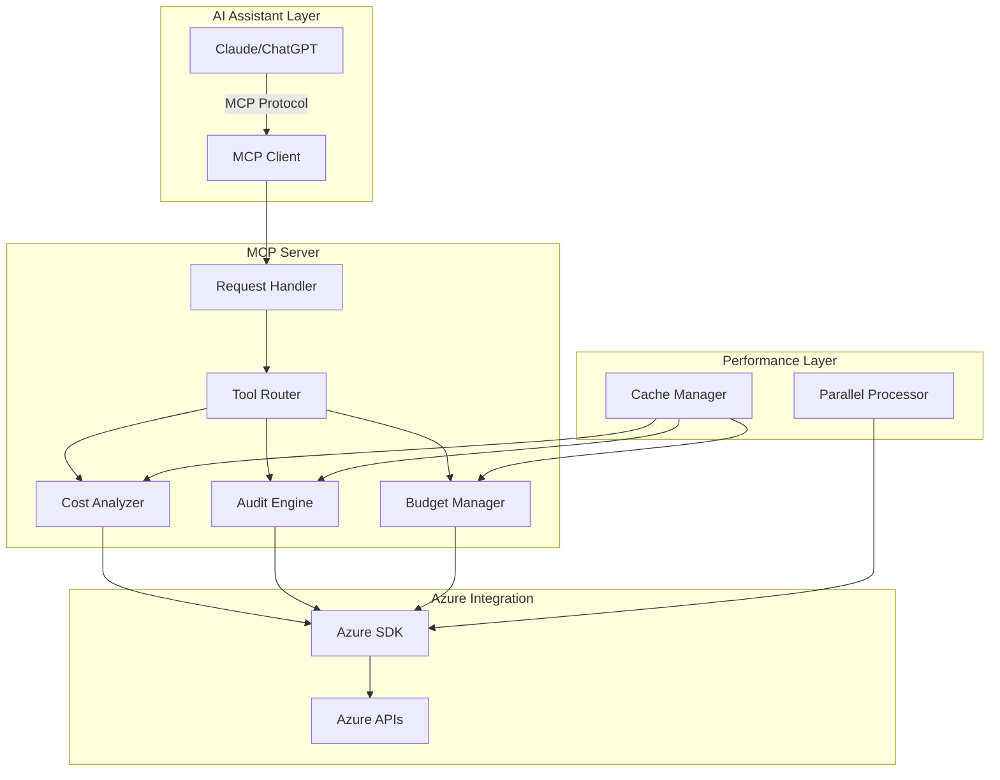

# Azure FinOps MCP Server

<div align="center">

[](https://pypi.org/project/azure-finops-mcp-server/)
[](https://pypi.org/project/azure-finops-mcp-server/)
[](https://opensource.org/licenses/MIT)
[](architecture/validation-report.md)
[](development/testing.md)

</div>

## Enterprise-Grade Azure FinOps for AI Assistants

The Azure FinOps MCP Server brings powerful cloud cost management capabilities directly into your AI assistant. Analyze spending, audit for waste, and optimize budgets using natural language - all while keeping your credentials secure on your local machine.

## 🚀 What's New in v2.0.0

- **100% Architecture Compliance** - Achieved perfect score (142/142) in comprehensive architecture validation
- **4.9x Performance Boost** - Parallel processing and optimized batch operations for lightning-fast analysis
- **Production-Ready Security** - All high-severity issues resolved with enterprise-grade security posture
- **Modular Design** - Refactored into focused, maintainable modules (<50 lines per function)

## Key Features

### 💰 Cost Analysis & Reporting
- **Multi-subscription support** - Analyze costs across all your Azure subscriptions
- **Flexible time ranges** - Last 7/30/90 days or custom date ranges
- **Granular filtering** - By service, resource group, location, or tags
- **Smart grouping** - Group costs by any dimension for insights
- **Export capabilities** - Generate reports in multiple formats

### 🔍 FinOps Audit & Optimization
- **Stopped VMs detection** - Find deallocated VMs still incurring storage costs
- **Unattached disks** - Identify orphaned disks wasting money
- **Public IPs** - Locate unused static IPs
- **Budget analysis** - Track budget utilization and forecasts
- **Savings recommendations** - Get actionable optimization suggestions

### 🏗️ Enterprise Architecture
- **Parallel processing** - Handle multiple subscriptions simultaneously
- **Intelligent caching** - Reduce API calls and improve response times
- **Retry logic** - Automatic recovery from transient failures
- **Comprehensive logging** - Full audit trail of all operations
- **Error handling** - Graceful degradation with detailed error messages

## Quick Start

### Installation

```bash
pip install azure-finops-mcp-server
```

### Basic Configuration

```bash
# Authenticate with Azure
az login

# Set your subscription (optional - will use all accessible subscriptions)
az account set --subscription "Your Subscription Name"
```

### MCP Client Setup (Claude Desktop)

Add to your Claude Desktop configuration:

```json
{
  "mcpServers": {
    "azure-finops": {
      "command": "azure-finops-mcp-server"
    }
  }
}
```

## Example Usage

### Cost Analysis Query
> "What were my Azure costs by service for the last 30 days?"

### Waste Audit
> "Find all stopped VMs and unattached disks in the eastus region"

### Budget Review
> "Show me budgets that are over 80% utilized with forecasts"

### Comprehensive Report
> "Generate a complete FinOps report for all subscriptions with savings recommendations"

## Architecture Overview



## Why Choose Azure FinOps MCP Server?

- **AI-Native Design** - Built specifically for LLM integration with natural language understanding
- **Secure by Default** - Credentials stay local, no cloud storage of sensitive data
- **Enterprise Performance** - Handle thousands of resources across multiple subscriptions
- **Actionable Insights** - Get specific recommendations, not just raw data

## Getting Help

- 📖 [User Guide](user-guide/overview.md) - Comprehensive usage documentation
- 🏗️ [Architecture](architecture/system-design.md) - Technical deep dive
- 🔧 [API Reference](api/tools.md) - Complete API documentation
- ❓ [FAQ](support/faq.md) - Common questions answered
- 🐛 [GitHub Issues](https://github.com/julianobarbosa/azure-finops-mcp-server/issues) - Report bugs or request features

## Contributing

We welcome contributions! See our [Contributing Guide](development/contributing.md) to get started.

## License

MIT License - See [LICENSE](license.md) for details.

---

<div align="center">
Built with ❤️ for the Azure FinOps community
</div>
